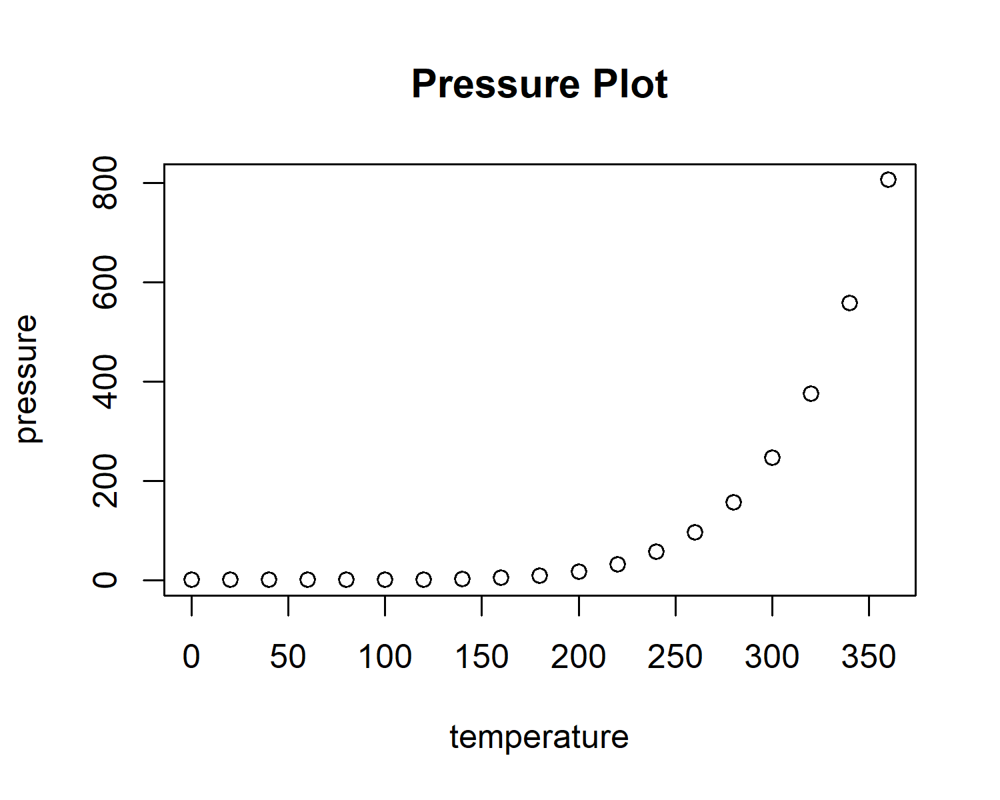

# A Really Long Heading so I see what happens when it takes up more than one line just in case we're getting crazy

\pagenumbering{arabic}

## Introduction

General background information and your literature review goes here. General background information and your literature review goes here. General background information and your literature review goes here. General background information and your literature review goes here. General background information and your literature review goes here. General background information and your literature review goes here. General background information and your literature review goes here. General background information and your literature review goes here. General background information and your literature review goes here. General background information and your literature review goes here. General background information and your literature review goes here.

## Methods

This is how I did the thing with this data (Table \@ref(tab:testtable))

```{r include=FALSE}
data("mtcars")
```

```{r testtable}
knitr::kable(summary(cars), caption = "Summary of the mtcars data.", booktabs=TRUE)
```

## Results A Really Long Heading so I see what happens when it takes up more than one line just in case we're getting crazy

### Level 3 A Really Long Heading so I see what happens when it takes up more than one line just in case we're getting crazy

#### Level 4 A Really Long Heading so I see what happens when it takes up more than one line just in case we're getting crazy

##### Level 5 A Really Long Heading so I see what happens when it takes up more than one line just in case we're getting crazy

###### Level 6 A Really Long Heading so I see what happens when it takes up more than one line just in case we're getting crazy

### A Really Long Heading so I see what happens when it takes up more than one line just in case we're getting crazy

These are my first results (Figure \@ref(fig:cars-plot)).

```{r cars-plot, fig.cap="The cars data. Sentence two.", fig.scap= "The cars data."}
#For a multi-sentence caption use fig.scap set as the first sentence so only that goes to the table of figures
plot(cars)  # a scatterplot
```

And then I also got these results (Figure \@ref(fig:test-fig)).

```{r include=FALSE}
png(filename = "Figures/pressure_plot.png",width = 5, height = 4, units = "in", res = 300)
plot(pressure, main="Pressure Plot")
dev.off()
```

```{r test-fig, fig.cap= "A really long figure caption so I see what happens when it takes up more than one line just in case we're getting crazy"}

```

```{r testtable-2}
knitr::kable(head(cars), caption = "A really long table caption so I see what happens when it takes up more than one line just in case we're getting crazy")
```

## Discussion

Now I tell you how this fits in the context of my field
