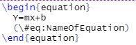

README
================
Author: Alexander Ilich

# What is this repository for?

This repository contains files to provide an Rmarkdown document that is (hopefully) consistent with the University of South Florida ETD thesis/dissertation formatting guidelines.

# How can I use this?

You can use this by cloning/downloading this repository. When using this I highly recommend using an RProject with version control and Rstudio \>= 1.4 so that you have the visual markdown editor and built in citations.

# Bookdown Project Structure

The repository is structured using the [bookdown project structure](https://bookdown.org/yihui/rmarkdown/bookdown-project.html). This consists of:

-   `Index.Rmd`: This is the only Rmd document to contain a YAML, and it will be the file you call to render your book.. This file contains all the YAML fields that are not sub-fields of what would normally be under the `output` field and the `setup` chunk. The `site: bookdown::bookdown_site` option brings up the build tab in Rstudio.

-   `_output.yml`: This is a YAML file specifying how different types of outputs should be formatted

-   `_bookdown.yml`: A configuration file for rendering your book (e.g. what the file name for the rendered book should be, what directory it should go to, what files should be included and in what order).

-   Child Documents: The various parts of your dissertation (e.g. 01_Chapter 1.Rmd)

-   `latex_preamble.tex`: This is the latex preamble code that modifies the Latex "report" document class formatting to make it USF ETD compliant.

-   `*.csl` file: csl files specify the citation format. If you wish to change the citation style, you can download one and change the csl field in the YAML header of `index.Rmd` You can find a lot of these csl files in the [Zotero Style Repository](https://www.zotero.org/styles).

-   `*.bib`: .bib files include your references. All references mentioned in your dissertation must be included in the `.bib` file.

# Rendering the Document

To render the book you can go to the "Build" tab in Rstudio and click "Build Book." You can also do this in command line using a call to `bookdown::render_book`.

Rendering the book will use the output directory specified in from `_bookdown.yml` which is set by default as the `config_file` argument, and will format the specified output type (e.g. PDF or word document) based on the options specified in the YAML fields of `index.Rmd` and `_output.yml`. **By default all files that end in .Rmd (unless the name start with an underscore) will be stitched together in alphabetical order.** If you wish to change this behavior you can add `rmd_files` as a field in `_bookdown.yml` to specify which documents should be included and in what order they should go. This should be formatted with `index.Rmd` as the first entry. Each entry should be enclosed in quotes and separated by commas, and the list of files should be enclosed in square brackets e.g. `rmd_files: ["index.Rmd", "00_Abstract.Rmd", "01_Chapter1.Rmd"].`

# The Child Documents

## `00_0Prelim.Rmd`

This document contains the title page, dedication, and acknowledgments. Go in here and replace the default information with yours (e.g. put in your title, college, advisor, etc). Note that the title page is coded in LaTeX. You should not need to mess with the formatting here, but will need to replace the relevant information which is enclosed in parentheses `()` . Also, note that in LaTex a `%` represents a comment and `\\` represents moving to the next line.

## `00_Abstract.Rmd`

This contains the abstract.

## Chapters

These Rmd files contain your chapters. `01_Chapter1.Rmd` has a call to `\pagenumbering{arabic}`. This resets the numbering from roman numerals to normal numbers.

The csl specifies the citation format, and the bibliography specifies where your references are located.

## Bibiography and Citations

### Important Files

The two files necessary for using citations are a `.csl` file which specifies the citation style and a `.bib` file which contains all the references mentioned in your dissertation.

If you wish to change the citation style, you can download one and change the csl field in the YAML header of `index.Rmd` You can find a lot of these csl files in the [Zotero Style Repository](https://www.zotero.org/styles).

### Connecting a .bib file to a Reference Managers

Rstudio's visual markdown editor has the option to insert citations under the "insert" menu. I have included a "references.bib file" as an example. There are several options for building a `.bib` file.

-   Option 1: Export your references from your reference manager to a BibTex file and use that.

    -   Pros:

        -   Easily portable to a new computer since the `.bib` file is located in the project directory

    -   Cons:

        -   You need to re-export your `.bib` file and copy it over whenever you add new references

-   Option 2: If you use Zotero, you can link Rmarkdown with Zotero under "Tools \> Global Options \> Rmarkdown \> Citations." Every time you add a reference from your Zotero library it will automatically be added to your `.bib` file.

    -   Pros:

        -   Easily portable to a new computer since the `.bib` file is located in the project directory

        -   You have access to your full Zotero library and don't need to re-export the `.bib` file since Rstudio automatically adds to the `.bib` file

    -   Cons:

        -   If you realize something is wrong in a reference and fix it in Zotero you cannot (as far as I know of) automatically update this in your `.bib` file as Rstudio does not sync your Zotero and `.bib` file, it just adds the reference as is from your Zotero library as you go if it is not already in your `.bib` file.

-   Option 3 (my preferred option): You can get the [Better BibTex extension for Zotero](https://retorque.re/zotero-better-bibtex/) and [set up auto-export](https://retorque.re/zotero-better-bibtex/exporting/auto/) to create an always up to date `.bib` file that is synced with your Zotero Library. Most of the cons for this section can be addressed by using an external auto-updated `.bib` file while working on the document, but copying over a static version of the `.bib` file once the manuscript is finished and updating the YAML in `index.Rmd` to now use that.

    -   Pros:

        -   You have access to your full Zotero library and don't need to re-export the `.bib` file

        -   If you make a changes in your Zotero library, they will be updated in your Rmarkdown citations/bibliography

    -   Cons:

        -   If you delete a reference from your Zotero Library, it will be deleted from the `.bib` file and your Rmarkdown document will not be able to find the reference.

        -   If you edit information that changes the "citation key" (e.g. author/year) this can break the linkage between the .bib file and the citation in your Rmarkdown document so you will need to go into the text and re-insert these references

        -   It is not easily portable to a new computer since the `.bib` file is likely located outside the project directory.

# Tables, Figures, Equations and Cross-Referencing

## Figures

Figures should be contained within a **named R-chunk** either by plotting or using `knitr::include_graphics("filepath")`. Captions for figures can be specified with the chunk option `fig.cap`. If you have a multi-sentence caption you should additionally supply a short caption using the `fig.scap` chunk option which you should set as the first sentence of the caption as per ETD guidelines.

## Tables

Tables should be contained within a **named R-chunk** using the `kable` function from the knitr package. Rather than in chunk arguments as for figures, table captions are created within the `kable` function's arguments `caption` and `caption.short` for full and short captions respectively. Again the short caption should be used if you have a multi-sentence caption in which you should set the short caption as the first sentence of the full caption as per ETD guidelines.

Tables can be further customized using the `kableExtra` package (e.g. editing font size, landscape orientation for wide tables, customizing the look of rows and columns). Some import options include `font_size` and setting `latex_options= "hold_position"` which can be useful if a table is floating into a weird spot. Both of these options can be accessed using `kableExtra::kable_styling` function.

### Equations

You can add inline and display math from the insert tab in the visual markdown editor in Rstudio or by enclosing it within single or double \$.

Additionally, you can insert numbered equations. For example:

## Cross-referencing

You can use bookdown's cross-referencing feature to refer to figure/table/equation numbers in the text and have them autoupdate as you add, remove or reorder content. Cross-referencing is done using "Insert \> Cross Reference" in the visual markdown editor or by using \@ref(fig:ChunkName) for figures, \@ref(tab:ChunkName) for tables, and \@ref(eq:EquationName) for equations. This is why we must use named chunks for tables and figures and names in our equations since that is how bookdown can keep track of them and update numbering if things are added or reordered. Note, cross-referencing only displays the number in your text so you need to precede this with figure/table/equation. For access to cross-referencing and other important features we need to use PDF and word documents generated by the bookdown package (e.g. bookdown::pdf_book, bookdown::pdf_document2 and bookdown::word_document2 instead of just pdf_document and word_document).

# Packages and Dependencies

You must have a LaTex distribution installed to knit PDF's. You can install a lightweight distribution of LaTeX from R using the code `install.packages("tinytex")` and then `tinytex::install_tinytex()`. Also you can check if you have already have this with `tinytex::is_tinytex().` Alternatively you could also install a different LaTeX distribution on your computer such as [MiKTeX](https://miktex.org/) which is popular for Windows users.

Additionally, this relies on the use of the knitr, rmarkdown, and bookdown R packages.

# ETD Guidelines

ETD formatting requirements can be found on the [Formatting Requirements section of their website](https://www.usf.edu/graduate-studies/students/electronic-thesis-dissertation/etd-formatting-requirements/). Additionally, I've gathered many of the PDFs from this site and placed them under the ETD guidelines folder.

# Bookdown Resources

<https://bookdown.org/yihui/bookdown/>

<https://github.com/rstudio/bookdown>
